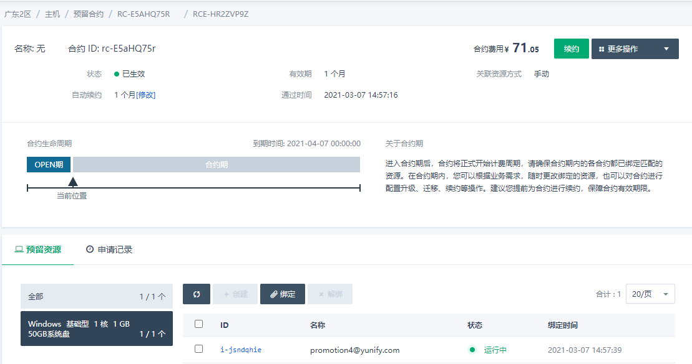

## 问题背景

用户购买云服务器后，发现操作系统并不是自己所需要的，目前无法直接更换操作系统。需要删除当前云服务器，并创建需要的操作系统云服务器，如果云服务器中有重要数据，需要自行拷贝下，谢谢。

## 操作步骤

如果云服务器是预留合约云服务器，可以按照下面的步骤操作下：

### Windows云服务器，删除后创建Linux云服务器

1. Windows云服务器：i-jsndqhie；云服务器合约：rc-E5aHQ75r

   

2. 将云服务器与合约解绑

   

3. 升级Windows云服务器合约为Linux云服务器合约，会退还差价

   

   

   

4. 创建Linux云服务器

   

   

   

### Linux云服务器，删除后创建Windows云服务器

1. Linux云服务器：i-ilqtvuh2；云服务器合约：rc-E5aHQ75r

   

2. 将云服务器与合约解绑

   

3. 升级Linux云服务器合约为Windows云服务器合约

   注意：Linux云服务器合约升级为Windows云服务器合约需要补差价

   

   

   

4. 创建Windows云服务器

   

   注意：也可以通过计算-云服务器界面创建与合约配置完全匹配的云服务器，然后手动绑定；直接在合约界面创建云服务器会自动绑定。